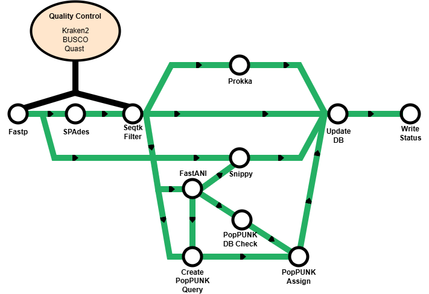
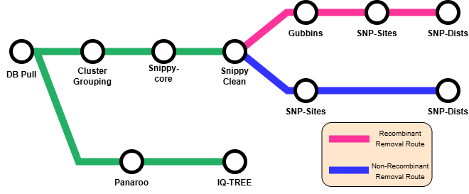
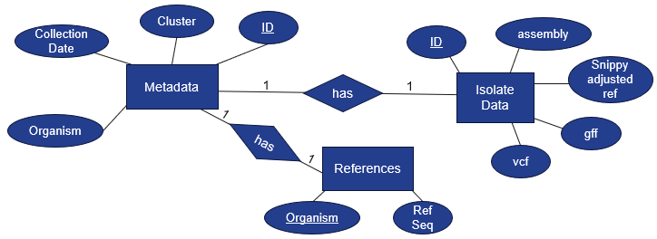

# Introduction 


<p style="width: 1000px;">**BacTrail** is a pipeline that is designed to perform actively passive surviellance of bacterial pathogens, and is composed of 2 workflows, ADD and ANALYZE. The idea is to take sequenced isolates and run the ADD workflow, which places metadata, annotation, an assembly, an alignment, and importantly, a cluster group ID in a SQLite database for each isolate. The cluster ID can lets users quickly and automatically identify isolates that roughly similar, one can imagine a large family tree. The workflow, ANALYZE, can then utilize the knowledge of which isolates are already somewhat similar, and perform a fine-grained relatedness analysis identifying which, if any, of the isolates in large family tree are highly related. To return to the family tree, this is similar to identifying which are siblings from within the more diverse family tree.</p>


<table>
  <tr>
    <td>
      <h3>ADD Workflow</h3>
      
    </td>
    <td>
      <h3>ANALYZE Workflow</h3>
      <p><br></p>
      
      <p><br></p>
    </td>
  </tr>
</table>


# Usage
> [!NOTE]
> If you are new to Nextflow and nf-core, please refer to [this page](https://nf-co.re/docs/usage/installation) on how to set-up Nextflow. Make sure to [test your setup](https://nf-co.re/docs/usage/introduction#how-to-run-a-pipeline) with `-profile test` before running the workflow on actual data.

The two workflows in this pipeline are run independently of eachother, and the workflow chosen is dependent on the goal. If the user wants to add more isolates to the database, then the ADD workflow should be chosen. If the user wants to perform relatedness analysis on the isolates already present in the database, the ANALYZE workflow should be chosen. In order to run the ANALYZE workflow, the isolates <em>must</em> be present in the database first.

<h3>ADD Workflow</h3>

The add workflow requires the following parameters:
```
  - samplesheet
    • csv file path, format described below
  - outdir
    • path for a diectory to hold the output
  - db_name
    • path to the database that will hold the isolate information, does not need to exist beforehand
  - schema_dir
    • path to a directory that contains popPUNK schemas
  - kraken2_db database path
    • path to a Kraken2 database
  - reference_list
    • text file containing the path to the reference genomes used with FastANI
  - reference_dir
    • directory containing the bacterial reference sequences to use with FastANI
```
An example samplesheet with the required columns are below.

`samplesheet.csv`
```csv
sample,fastq1,fastq1,collection_date
sampleID,sample_R1.fastq.gz,sample_R2.fastq.gz,MM-DD-YYYY
```

The workflow is run with the command:
```
 nextflow run BacTrail \
    --mode ADD \
    --input samplesheet.csv \
    --outdir results \
    --db_name bactrail.db \
    --schema_dir schemas \
    --kraken2_db kraken2db \
    --reference_list reference_paths.txt \
    --reference_dir FastANI_references \
    -profile [docker/singularity]
```

<h3>ADD Workflow Output</h3>

The ADD workflow has 2 main output files. The first of these is the MultiQC report, which is located at ```[outdir]/multiqc/multiqc_report.html```. This contains all of the quality information about the isolates that were just added to the database. The second is located at ```[outdir]/write_status/insert_status.csv```. This a csv with the columns: Sample, Status, and Cluster and shows if the sample was successfully added, and importantly which popPUNK cluster the isolate was assigned to. The cluster lets the user know if isolates are somewhat similar, and is an indication that a fine-grained analysis with the ANALYZE workflow is meritted for that sample.

<h3>Isolate Database ER Diagram</h3>



<h3>ANALYZE Workflow</h3>

The ANALYZE workflow requires the following parameters:
```
  - db_name
    • path to the database that will hold the isolate information, does not need to exist beforehand
  - organism
    • Which organism in the database to analyze
  - outdir
    • path for a diectory to hold the output
```
The workflow is run with the command:
```
 nextflow run BacTrail \
    --mode ANALYZE \
    --outdir results \
    --db_name bactrail.db \
    --organism [Klebsiella_pneumoniae/Escherichia_coli/...]
    -profile [docker/singularity]
```


> [!WARNING]
> Please provide pipeline parameters via the CLI or Nextflow `-params-file` option. Custom config files including those provided by the `-c` Nextflow option can be used to provide any configuration _**except for parameters**_;
> see [docs](https://nf-co.re/usage/configuration#custom-configuration-files).

For more details and further functionality, please refer to the [usage documentation](https://nf-co.re/bactrail/usage) and the [parameter documentation](https://nf-co.re/bactrail/parameters).

## Pipeline output

To see the results of an example test run with a full size dataset refer to the [results](https://nf-co.re/bactrail/results) tab on the nf-core website pipeline page.
For more details about the output files and reports, please refer to the
[output documentation](https://nf-co.re/bactrail/output).

## Credits

BacTrail was originally written by David Schaeper.

## Citations

<!-- TODO nf-core: Add citation for pipeline after first release. Uncomment lines below and update Zenodo doi and badge at the top of this file. -->
<!-- If you use nf-core/bactrail for your analysis, please cite it using the following doi: [10.5281/zenodo.XXXXXX](https://doi.org/10.5281/zenodo.XXXXXX) -->

<!-- TODO nf-core: Add bibliography of tools and data used in your pipeline -->

An extensive list of references for the tools used by the pipeline can be found in the [`CITATIONS.md`](CITATIONS.md) file.

You can cite the `nf-core` publication as follows:

> **The nf-core framework for community-curated bioinformatics pipelines.**
>
> Philip Ewels, Alexander Peltzer, Sven Fillinger, Harshil Patel, Johannes Alneberg, Andreas Wilm, Maxime Ulysse Garcia, Paolo Di Tommaso & Sven Nahnsen.
>
> _Nat Biotechnol._ 2020 Feb 13. doi: [10.1038/s41587-020-0439-x](https://dx.doi.org/10.1038/s41587-020-0439-x).
